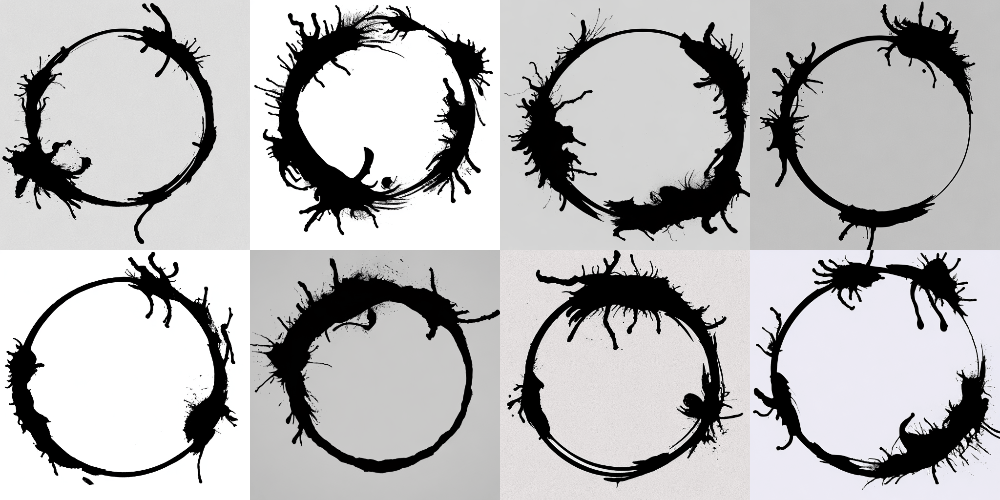

# Generating Heptapod writing with Stable Diffusion
Thanks to the work of Dr. Louise Banks and state-of-the-art
text-to-image models, it is now possible to generate images of
Heptapod writing using the Stable Diffusion model.  The following are
sample images produced by the model with the prompt `photo of
heptagram, white background`.  Recommended negative prompt:
`concentric circles`.

## Overview
The Stable Diffusion model is an open-source latent diffusion-based
text-to-image model that can generate images of Heptapod writing based
on text inputs. It uses a pre-trained model to generate images that
are faithful to the unique circular, non-linear structure of the
Heptapod language.

## Disclaimer
Please note that while the Stable Diffusion model is highly advanced
and has been trained on the language of the Heptapods, there is always
a risk of mistranslation. We cannot be held responsible for any
misinterpretation of Heptapod language, especially if it involves
confusing the words "weapon" and "tool". We highly recommend
consulting with a linguistics expert, such as Dr. Louise Banks, before
attempting any communication with extraterrestrial beings.
